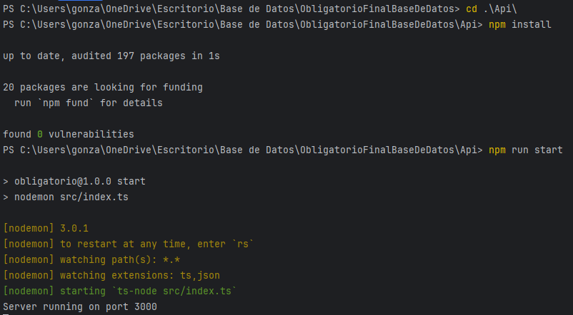
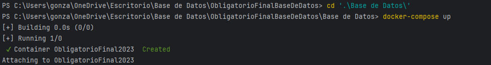
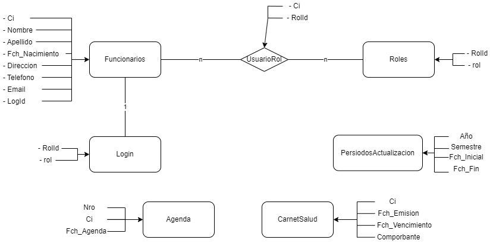
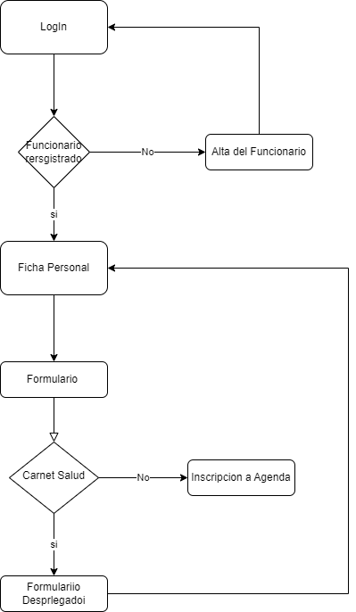
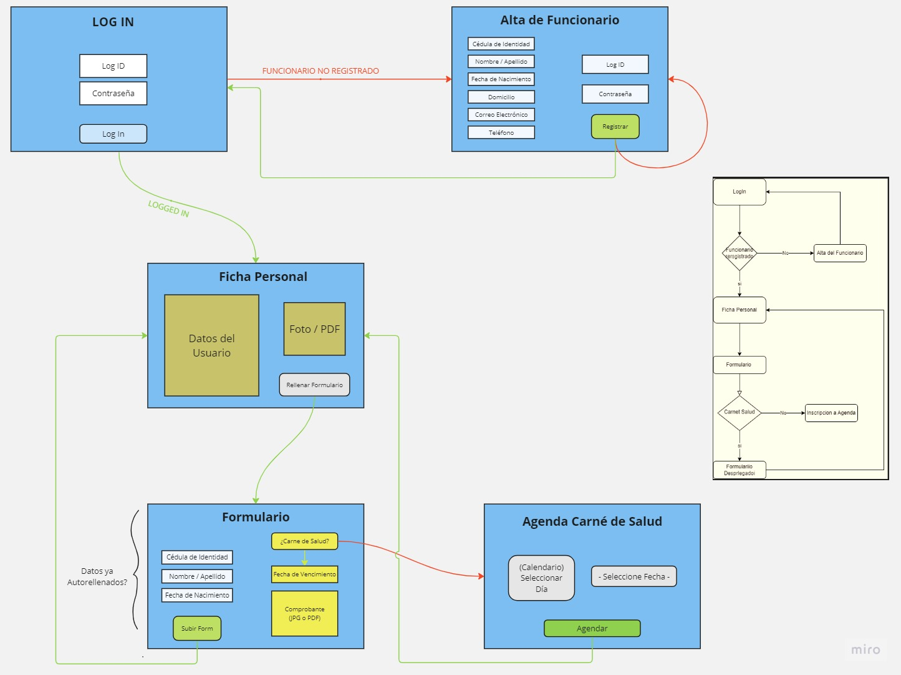

# ObligatorioFinalBaseDeDatos

## Instructivo de instalacion
En esta seccion se detallara como instalar el proyecto en su computadora.
### Primer Paso: 
- Clonar el repositorio en su computadora.

### Segundo Paso:
- Abrir una consola en la caprta del proyecto.
- Moverse a la carpeta "Api" con el comando `cd Api`.
- Ejecutar el comando `npm install` para instalar las dependencias del proyecto.
- Ejecutar el comando `npm run start` para iniciar el servidor.

### Tercer Paso:
- Abrir Docker
- Abrir otra consola en la carpeta del proyecto.
- Moverse a la carpeta "Base de Datos" con el comando `cd Base de Datos`.
- Ejecutar el comando 'docker-compose up' para iniciar la base de datos en Docker.

### Cuarto Paso:
- Abrir en el explorador de archivos la carpeta del proyecto
- Moverse a la carpeta "Frontend"
- Abrir el archivo "index.html" con el navegador de su preferencia. 

## Api
La api esta desarrollada en Node.js con el framework Express.js.\
Esta compuesta por 2 archivos principales (index.ts, dataBase.ts) y  2 carpetas principales (Controllers y Routes).\
En el archivo index.ts se encuentran las configuraciones del servidor y las rutas de la api.\
En el archivo dataBase.ts se encuentra la configuracion y la coneccion de la base de datos.\
En la carpeta Controllers se encuentran los controladores de cada tabla de la base de datos.\
En la carpeta Routes se encuentran las rutas de cada tabla de la base de datos.\

## Base de Datos
La base de datos esta compuesta por 7 tablas, las cuales son:
- Funcionarios
- Agenda
- Logins
- Carnet de Salud
- Periodos de Actualizacion
- Roles
- Funcionarios Roles

### Diagrama MER de la Base de Datos

### Endpoints

#### Funcionarios

- postFuncionarios
- getFuncionarios
- getFuncionariosByCi
- putFuncionario
- deleteFuncionario

#### Agenda

- postAgenda
- getAgenda
- getAgendaByCi
- putAgenda
- deleteAgenda

#### Lgoins

- postLogin
- getLogins
- getLoginById
- putLogin
- deleteLogin

#### Carnet de Salud

- postCarnetSalud
- getCarnetSalud
- getCarnetSaludByCi
- putCarnetSalud
- deleteCanetSalud

#### Periodos de Actualizacion

- postPeriodosActualizacion
- getPeriodosActualizacion
- getPeriodosActulaizacionByAño
- putPersiodosActualizacion
- deletePeriodoActualizacion

#### Roles

- postRol
- getRol
- getRolByCi
- putRol
- deleteRol

## Frontend

### Diagrama del flujo de la aplicacion

### Diagrama visual del flujo de la aplicacion

## Autores
Pablo Constantino\
Enzo Cantoni\
Gonzalo Juarez

## To do
- Agenda Carnet base de datos (enzo) 
- - cargar las fechas disponibles
- - guardar en base de datos 
- periodo de actualizacion (pablo)
- - Cargar fecha agenda
- - contolar actualizacion de datos dentro de fecha 
- - cambio de periodo de actualizacion
- formulario carnet de salud (gonza)
- - Editar carnet de salud
- - arreglar cosas